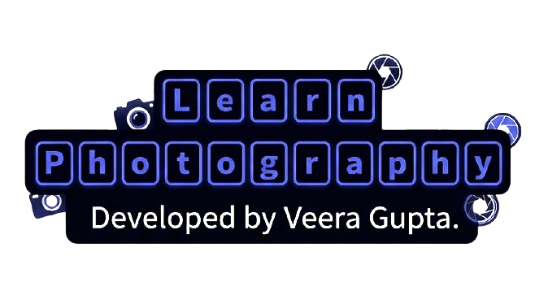

# 📸 RV_LearnPhotography

  

A full-stack web application designed to teach photography fundamentals, featuring user authentication and a dynamic feedback system.

 

## 🚀 Overview

Developed as a primary Web Programming project for BSc. IT (First Year). This platform was inspired by a college photography workshop, combining educational content with a secure backend.

 

## ✨ Key Features

* **User Management:** Secure Registration and Login system.

* **Interactive Learning:** Structured modules on camera setup, lenses, and techniques.

* **Feedback System:** A dedicated contact/feedback portal that stores user messages in a MySQL database.

* **Clean Architecture:** Organized file structure with separated assets and server-side logic.

 
## 🛠️ Tech Stack

* **Frontend:** HTML, CSS

* **Backend:** PHP

* **Database:** MySQL (WAMP Server)

 

## 📁 Project Structure

* `assets/` - Contains all CSS and project imagery.

* `sql/` - Contains the database schema for easy local setup.

* `*.php` - Core logic for routing and database interaction.

 

## 👥 Credits

* **Veera Gupta:** Full-stack Development, Database Architecture, and UI Design.

* **Ranjana Alagi:** Content Strategy and Project Documentation.

 

## ⏯️ Preview of RV_LearnPhotography

https://github.com/user-attachments/assets/c47c5d55-0f2a-413f-ba32-9a43ddff55a4

